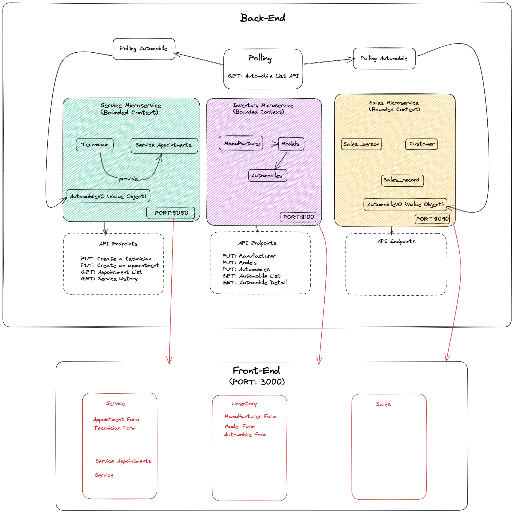

# Project CarCar

     

## Table of Content
* [Instruction to Run the Project](#instruction)
* [Diagram of the Project](#diagram)
* [Explanation for Services URLs and Ports](#urlAndPorts)
* [CRUD Route Documentation](#crud)
* [Value Objects](#vo)

## Instruction
For this repository to get the code. And a docker desktop app is required to run the application. 
After opend docker desktop appp, run the folling command line on terminal in your working project directory.

1. `docker volume create beta-data`
2. `docker-compose build`
3. `docker-compose up`

* When you run __docker-compose up__ and if you're on macOS, you will see a **warning** about an environment variable named **OS** being missing. __You can safely ignore this__.

## Diagram

Team:

* Kahar - Appoinment Service
* Person 2 - Which microservice?

## Design

## Service microservice

Explain your models and integration with the inventory
microservice, here.

## Sales microservice

Explain your models and integration with the inventory
microservice, here.
