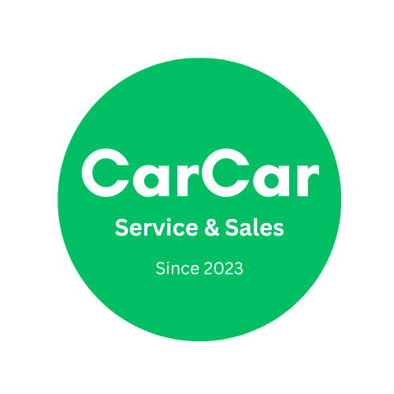

# Project CarCar

     

Team:

* Person 1 - Which microservice?
* Person 2 - Which microservice?

## Design

## Service microservice

Explain your models and integration with the inventory
microservice, here.

## Sales microservice

Explain your models and integration with the inventory
microservice, here.
